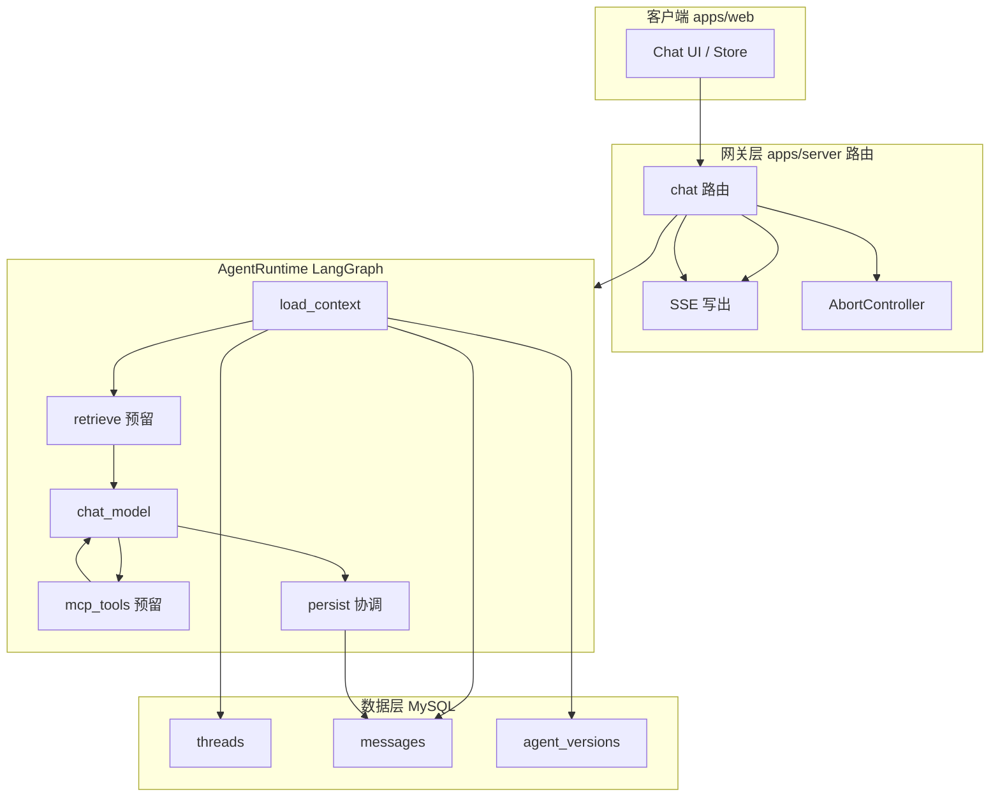

# 智能体对话模块：基于 LangChain / LangGraph 的记忆与编排技术方案

| 项     | 内容 |
|--------|------|
| 文档类型 | 技术开发方案 |
| 适用范围 | `part-4` 仓库：智能体创建与分享平台 — 对话（Chat）子系统 |
| 关联系统 | `apps/server`（Express）、`apps/web`（Vue）、MySQL |
| 版本   | v1.0 |
| 状态   | 待评审 / 实施依据 |

---

## 1. 引言

### 1.1 编写目的

本文档用于指导对话模块从「单路由直连大模型 API」演进为「可记忆、可编排、可扩展」的智能体运行时，明确架构边界、数据流、记忆策略及与 RAG/MCP 的衔接方式，作为开发、联调与验收的依据。

### 1.2 目标读者

后端开发、前端开发（SSE 协议对齐）、测试、技术负责人。

### 1.3 参考资料

- LangGraph 官方文档：状态图（StateGraph）、Checkpoint、流式事件。
- LangChain JS 文档：`ChatOpenAI`、消息类型、Tool 绑定。
- 本项目：`apps/server/src/routes/chat.ts`、`apps/server/src/config/schema.sql`、`apps/server/src/routes/agents.ts`。

---

## 2. 项目背景与建设目标

### 2.1 背景

平台定位为智能体创建与分享。当前对话能力已在服务端落库会话与消息，但编排逻辑集中在路由内直接调用 OpenAI；历史上下文采用固定条数截取，缺少系统化摘要与图级状态管理，后续接入 RAG、MCP 时易致路由膨胀、难以测试与演进。

### 2.2 建设目标

1. **记忆**：在现有 `threads` / `messages` 模型上，提供可持续的多轮上下文能力（必要时常摘要），避免仅靠有限条数历史导致的「长会话失忆」。
2. **编排**：使用 LangGraph 定义可测试的智能体运行图，模型调用、未来检索与工具调用以节点/边表示，职责清晰。
3. **兼容**：保持现有 SSE 事件约定，前端协议尽量不改动。
4. **可扩展**：`agent_versions` 已具备 `rag_config`、`mcp_config`，方案需预留节点与配置读取路径，避免二次重构。

### 2.3 非目标（本期可不实现）

- 向量库选型与全文检索产品的最终拍板（仅预留设计位）。
- MCP 服务端具体清单与安全审计细则（可实现占位与 allowlist 设计）。
- 多租户隔离策略的重新设计（沿用现有 `user_id` / `thread` 归属模型）。

---

## 3. 术语与缩略语

| 术语 | 说明 |
|------|------|
| Thread | 会话，对应表 `threads.id`，与前端 `thread_id` 一致。 |
| Agent Version | 智能体 immutable 配置版本，对应 `agent_versions`。 |
| LangGraph State | 单次图运行中的结构化状态（如 `messages`、预留的检索结果等）。 |
| Checkpointer | LangGraph 将图运行中间状态持久化/恢复的组件（如 MemorySaver、DB 类 Saver）。 |
| SSE | Server-Sent Events，当前聊天流式推送方式。 |

---

## 4. 需求概述

### 4.1 功能需求

- FR-1：用户在同一 `thread_id` 下多轮对话，模型应能利用该 thread 的历史消息（在 Token 预算内）。
- FR-2：超长会话下，应支持滚动摘要等策略，利用 `threads.summary`（或等价字段）保留远期语义，避免上下文被硬截断。
- FR-3：对话请求仍通过鉴权，thread 与 `agent_id` 绑定关系与现逻辑一致。
- FR-4：后续可基于 `rag_config` 增加检索节点，基于 `mcp_config` 增加工具/MCP 调用节点，无需推翻会话存储模型。

### 4.2 约束

- 持久化存储为 MySQL；不强制首期引入 LangGraph 官方 Postgres Checkpoint（可选）。
- 生产环境与测试环境可通过不同路由或配置区分流式来源（现有 `/stream` 与 `/stream-test` 模式可保留）。

---

## 5. 现状分析

### 5.1 数据模型（摘录）

- `agents` / `agent_versions`：`system_prompt`、`rag_config`、`mcp_config`（JSON）。
- `threads`：`user_id`、`agent_id`、`agent_version`、`summary`（可用于会话级摘要）。
- `messages`：`thread_id`、`role`、`content`、时间序。

### 5.2 当前服务端行为（要点）

- `POST /api/chat/stream`：创建/校验 thread，写入用户消息；从 `messages` 读取历史（当前实现为有限条数），拼装 OpenAI `messages`，流式调用后写入 assistant 消息。
- `POST /api/chat/stream-test`：模拟流式，不调用大模型；**不依赖历史拼上下文**。
- 前端 `createChatStream` 若指向 `stream-test`，联调时易表现为「无上下文记忆」，需在环境与文档中区分说明。

### 5.3 主要差距

1. 历史策略简单（条数上限），未与 `threads.summary` 联动。  
2. 业务编排与 HTTP 路由耦合，难以增量加入 RAG/MCP。  
3. LangGraph 内存态（MemorySaver）仅适用于进程内/非持久场景，不能单独作为平台级用户记忆源。

---

## 6. 总体设计

### 6.1 设计原则

1. **薄路由、厚运行时**：Express 路由负责认证、thread 校验、SSE 封装与中断；智能体逻辑集中在 AgentRuntime（LangGraph）。
2. **库表为产品记忆真源**：用户可见历史以 `messages` 为准；`summary` 为压缩记忆载体。
3. **Checkpoint 按需引入**：首期可用「每次请求从 DB 装载 State」；多步 Tool 强依赖断点恢复时再上持久化 Checkpointer。
4. **协议稳定**：保留 `start` / `token` / `end` / `error` 事件语义。

### 6.2 逻辑架构

---

## 7. 详细设计

### 7.1 模块划分

| 模块 | 职责 |
|------|------|
| `routes/chat.ts`（或等价） | 参数校验、thread 与 agent 版本绑定校验、SSE、取消、异常映射。 |
| `agent/runtime`（建议新建目录） | 编译图、注入配置、`thread_id` / `user_id` 上下文、流式桥接。 |
| `agent/graph` | `StateGraph` 定义：节点、边、条件边（预留 tool loop）。 |
| `agent/memory`（可选命名） | 从 DB 构建 `messages`、Token 截断、摘要触发与 `summary` 读写。 |

### 7.2 LangGraph 状态（State）定义

建议字段（可按 LangGraph `Annotation` 实际 API 落地）：

| 字段 | 类型 | 说明 |
|------|------|------|
| `messages` | `BaseMessage[]` | 面向模型的多轮消息；含 system / human / ai。 |
| `summary` | `string \| null` | 来自 `threads.summary`，注入 system 或独立 system 块。 |
| `retrieved_docs` | 预留 | RAG 检索结果。 |
| `scratchpad` | 预留 | 工具调用中间结果（与 MCP 对齐）。 |

### 7.3 图结构（分期）

**首期（MVP）**

- 节点：`load_context` → `chat_model` →（可选）`update_summary`（异步或同步策略由负载决定）。
- 边：线性；流式仅发生在 `chat_model`。

**扩展期**

- 在 `chat_model` 前插入 `retrieve`（读 `rag_config`）。
- 在 `chat_model` 与工具之间增加条件边：存在 tool_calls 则进入 `mcp_tools`，否则结束写库。

### 7.4 记忆与持久化策略

#### 7.4.1 短期记忆（默认）

- 从 `messages` 按 `thread_id` 时间升序读取；在 **Token 预算**（或字符近似）内从尾部截取，而非仅固定条数。
- 本轮用户消息写入后，历史装配需与当前实现一致（避免重复或遗漏当前轮）。

#### 7.4.2 会话摘要（建议启用）

- 当历史超过阈值：将更早的对话压缩为摘要，写入 `threads.summary`（滚动摘要：旧摘要 + 新增片段再摘要）。
- 装配顺序建议：`system_prompt` → `summary`（若有）→ 近期原始 `messages` → 当前用户输入。

#### 7.4.3 LangGraph Checkpointer 与内存

- **MemorySaver**：仅开发、单实例演示；**不作为**唯一用户记忆源。
- **持久化 Checkpointer**：在多步工具、需跨步骤恢复同一逻辑 run 时引入；若采用，需明确与 `messages` 的职责分界（checkpoint 偏运行时，messages 偏产品展示与审计）。

### 7.5 与现有 API / SSE 的衔接

- 请求体：`agent_id`、`thread_id`、`content` 保持不变。
- 响应事件：
  - `start`：返回 `assistantMessageId`、`createdAt`；
  - `token`：增量内容；
  - `end`：`usage` / `aborted` 及 token 统计（可与现逻辑对齐）。
- `AbortController.signal` 传入模型调用链，与现 `activeStreams` 一致。

### 7.6 RAG 预留设计

- 配置源：`agent_versions.rag_config`（向量库连接、collection、topK、embedding 模型等）。
- 节点：`retrieve` 输出写入 `retrieved_docs`，由 `chat_model` 前的 prompt 模板消费。
- 失败策略：检索失败降级为无检索对话，并打日志（可配置是否向用户提示）。

### 7.7 MCP 预留设计

- 配置源：`agent_versions.mcp_config`（服务地址、允许的工具列表、鉴权方式）。
- 节点：`mcp_tools` 将 MCP tool schema 映射为 LangChain Tool；**服务端 allowlist** 与配置一致。
- 安全：禁止未授权工具名、超时与熔断策略在 Runtime 层统一实现。

### 7.8 技术选型与依赖

| 组件 | 选型 |
|------|------|
| 编排 | `@langchain/langgraph` |
| 消息与模型 | `@langchain/core`、`@langchain/openai`（与现有 OpenAI 兼容网关共用环境变量） |
| 服务端运行时 | Node.js（与现 Express 一致） |

环境变量建议继续沿用：`OPENAI_API_KEY`、`OPENAI_BASE_URL`、`OPENAI_MODEL`。

---

## 8. 安全设计要点

- 所有对话接口保持 `authenticateToken`；`thread` 归属 `user_id` 校验不变。
- MCP 与 RAG 涉及外连与密钥：配置不落日志明文；`mcp_config` / `rag_config` 权限与 Agent 编辑权限对齐。
- 提示词注入：摘要与检索片段需边界标注，降低指令覆盖风险（实现阶段细化模板）。

---

## 9. 非功能性需求

| 类别 | 要求 |
|------|------|
| 可用性 | 与现有一致；图内节点失败可降级策略（尤其 RAG）。 |
| 性能 | Token 截断与摘要异步化（可选）以降低首字延迟。 |
| 可观测 | 统一 `thread_id`、`agent_id`、`agent_version` 打日志；关键节点耗时指标（实施后接入）。 |
| 可测试 | AgentRuntime 单测覆盖：history 装配、摘要触发条件、mock LLM 流。 |

---

## 10. 风险与应对

| 风险 | 影响 | 应对 |
|------|------|------|
| LangChain/LangGraph 版本与流式 API 变更 | 集成成本 | 锁定主版本；封装 `streamToSSE` 适配层。 |
| 摘要质量与成本 | 费用与延迟 | 阈值 + 小模型摘要可选；异步更新 summary。 |
| 前后端误用 `stream-test` | 误以为无记忆 | 文档与环境变量约定；本地开发可选用真实 stream。 |
| 多实例无共享 MemorySaver | 数据不一致 | 生产不以 MemorySaver 为唯一持久化；依赖 DB 装载。 |

---

## 11. 实施计划与里程碑

| 阶段 | 交付物 | 验收要点 |
|------|--------|----------|
| P0 | AgentRuntime + LangGraph 单 LLM 线性图；DB 装载/写回；SSE 不变 | 同 thread 多轮语义连续；中断可用 |
| P1 | Token 预算截断 + `threads.summary` 滚动摘要 | 长会话远期信息可通过摘要体现 |
| P2 | `retrieve` 节点 + `rag_config` | 配置驱动检索；失败降级 |
| P3 | MCP 客户端 + `mcp_tools` + `mcp_config` | allowlist 与超时；工具循环稳定 |

---

## 12. 附录

### 12.1 与本文档直接相关的代码路径（仅索引）

- `apps/server/src/routes/chat.ts` — 流式聊天与消息持久化。  
- `apps/server/src/config/schema.sql` — `threads`、`messages`、`agent_versions`。  
- `apps/web/src/utils/api.ts` — SSE 请求路径与后端对齐说明。

### 12.2 文档修订记录

| 版本 | 日期 | 修订说明 | 作者 |
|------|------|----------|------|
| v1.0 | 2026-04-02 | 初稿 | — |

---

**说明**：本文档为技术方案层设计，具体类名、目录名与接口签名以实际迭代为准；实施时应通过 PR 描述引用本文档章节号，便于追溯。
